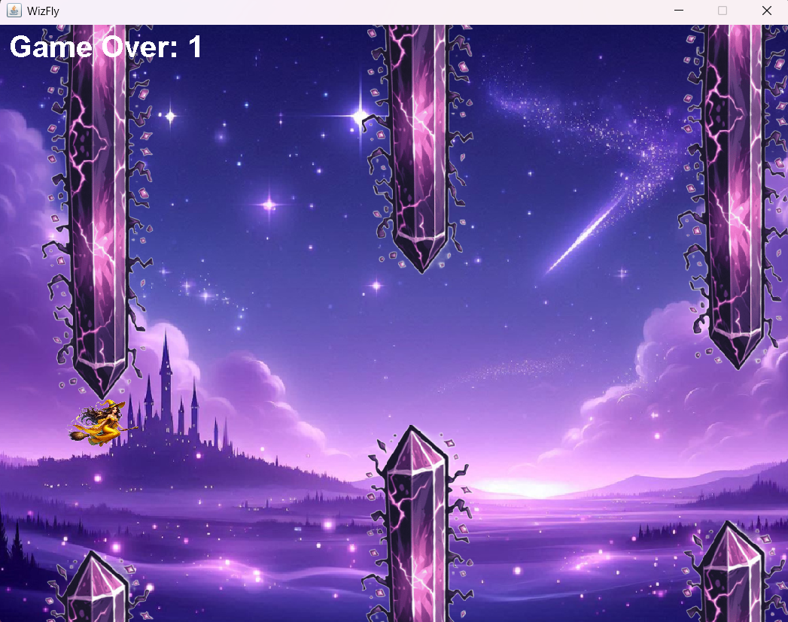

# 🧙‍♀️ WizFly

**WizFly** is a fantasy-themed, side-scrolling flying game made in Java using Swing. Guide your golden-cloaked wizard through an enchanted sky while dodging cursed magical crystals to stay alive and rack up points!

---

## 🖼️ Game Preview



---

## 🎮 How to Play

- **Press the Spacebar** to flap the wizard's broom upward.
- **Avoid collisions** with the top and bottom cursed crystals.
- **Try to survive** as long as you can and beat your high score!

---

## 🗃️ File Structure

```
WizFly_game/
├── App.class                  # Main runner class
├── App.java
├── WizFly.class               # Main game logic
├── WizFly.java
├── WizFly$Crystal.class       # Crystal inner class
├── WizFly$wizard.class        # Wizard inner class
├── WizFly$1.class             # Anonymous event handler class
├── bottomcrystal1.png         # Bottom cursed crystal
├── topcrystal.png             # Top cursed crystal
├── wizard.png                 # Wizard on broom image
├── wizflybg.png               # Background image
```

---

## ✅ Requirements

- Java JDK (Version 8 or later)

---

## 🚀 How to Run

1. Open your terminal or command prompt.
2. Navigate to the `WizFly_game/` directory.
3. Compile and run the game:

```bash
javac *.java
java App
```

Ensure all image assets (`.png` files) are in the same directory as your `.java` files.

---

## ✨ Features

- Animated flying wizard on broomstick
- Magical purple night sky background
- Rotated cursed crystals as obstacles
- Game over text with score display
- Seamless vertical gameplay with gravity and collision detection

---

## 🔮 Future Enhancements

- Sound effects and magical background music
- Power-ups like shields or slow-time spells
- Multiple wizard characters to choose from
- Score leaderboard system
- Increasing difficulty over time

---

<<<<<<< HEAD
## 📸 Screenshots


---

=======
>>>>>>> 9821321dc98b978c06ef953b141483de3b51ca09
## 🧑‍💻 Built With

- Java (Swing for GUI)
- Custom artwork and assets

---

## 🌟 Credits

- Game design : [JAYATI AHUJA]
- Assets created using AI-generated tools and manual editing

---

## 🧙 Final Note

Take off on your broom, dodge the cursed crystals, and let the wizardry begin! ✨
